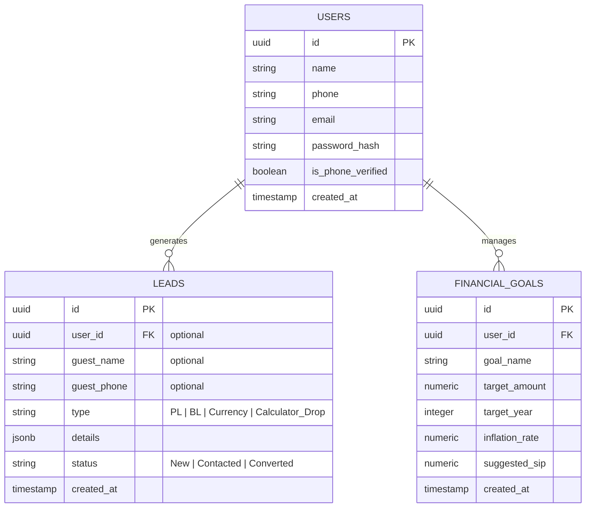

# 4. Database Schema

Relational database schema for the application (Postgres).

## 4.1 Entity Relationship Diagram

## 4.2 Data Dictionary

### 4.2.1 Users
- `id`: UUID PK.
- `name`: Full name.
- `phone`: Unique mobile number.
- `email`: Unique email address.
- `password_hash`: Bcrypt hash.
- `is_phone_verified`: OTP status.

### 4.2.2 Leads
- `id`: UUID PK.
- `user_id`: FK users.id (nullable).
- `type`: Enquiry type (Loan, Calculator, etc).
- `details`: JSONB form data.
- `status`: Lifecycle status (New, Contacted).

### 4.2.3 Financial Goals
- `id`: UUID PK.
- `user_id`: FK users.id.
- `goal_name`: e.g., 'Retirement'.
- `target_amount`: Target in INR.
- `target_year`: Completion year.
- `suggested_sip`: Monthly investment.
