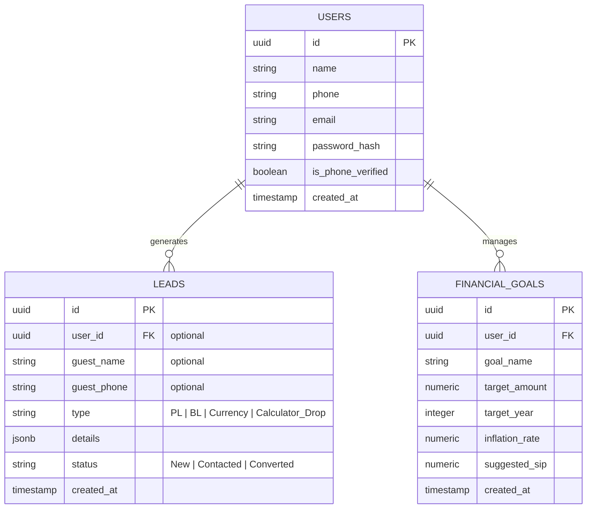

# 4. Database Schema (The Application)

This document defines the relational database schema for The App. We use **Postgres** for persistence.

## 4.1 Entity Relationship Diagram (ERD)

## 4.2 Data Dictionary

### 4.2.1 Users Table
| Column | Type | Constraints | Description |
| :--- | :--- | :--- | :--- |
| `id` | UUID | PRIMARY KEY, DEFAULT gen_random_uuid() | Unique user identifier. |
| `name` | VARCHAR(100) | NOT NULL | User's full name. |
| `phone` | VARCHAR(20) | UNIQUE, NOT NULL | Mobile number for lead tracking/OTP. |
| `email` | VARCHAR(255) | UNIQUE, NOT NULL | Primary email address. |
| `password_hash` | TEXT | NOT NULL | Bcrypt hashed password. |
| `is_phone_verified` | BOOLEAN | DEFAULT FALSE | Status of OTP verification. |
| `created_at` | TIMESTAMP | DEFAULT CURRENT_TIMESTAMP | Audit timestamp. |

### 4.2.2 Leads Table
| Column | Type | Constraints | Description |
| :--- | :--- | :--- | :--- |
| `id` | UUID | PRIMARY KEY | Lead identifier. |
| `user_id` | UUID | FOREIGN KEY (users.id) | Linked user (null for guests). |
| `guest_name` | VARCHAR(100) | NULL | Name provided by guest users. |
| `guest_phone` | VARCHAR(20) | NULL | Phone provided by guest users. |
| `type` | VARCHAR(50) | NOT NULL | Enquiry type (Loan, Calculator, etc). |
| `details` | JSONB | NOT NULL | Specific form data (loan amt, tenure). |
| `status` | VARCHAR(20) | DEFAULT 'New' | Lead lifecycle status. |
| `created_at` | TIMESTAMP | DEFAULT CURRENT_TIMESTAMP | Submission time. |

### 4.2.3 Financial Goals Table
| Column | Type | Constraints | Description |
| :--- | :--- | :--- | :--- |
| `id` | UUID | PRIMARY KEY | Goal identifier. |
| `user_id` | UUID | FOREIGN KEY (users.id) | Owner of the goal. |
| `goal_name` | VARCHAR(100) | NOT NULL | e.g., 'Retirement', 'Home'. |
| `target_amount` | NUMERIC(15,2) | NOT NULL | Financial target in INR. |
| `target_year` | INTEGER | NOT NULL | Target completion year. |
| `inflation_rate` | NUMERIC(4,2) | DEFAULT 6.0 | Assumed inflation. |
| `suggested_sip` | NUMERIC(15,2) | NOT NULL | Calculated monthly investment. |
| `created_at` | TIMESTAMP | DEFAULT CURRENT_TIMESTAMP | Creation time. |
