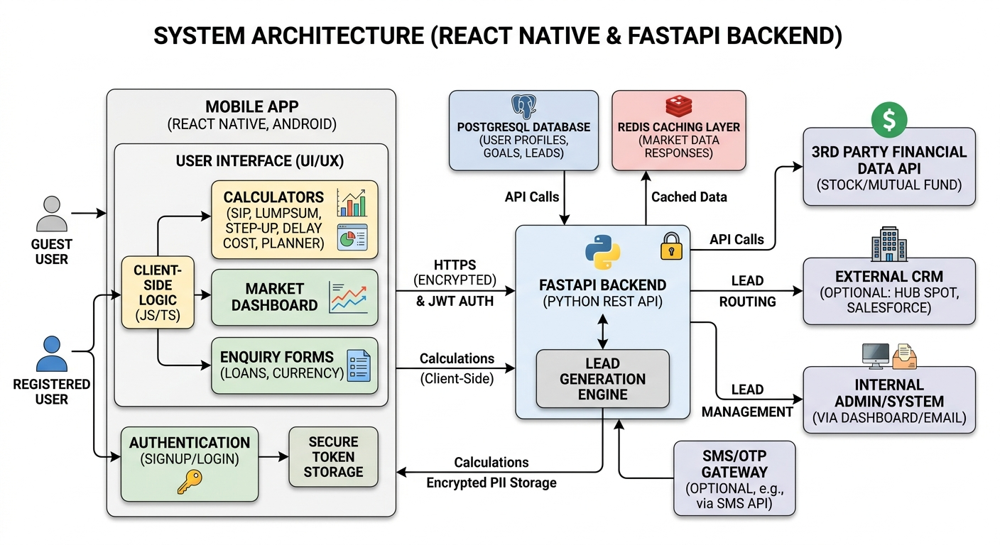

# Software Requirements Specification (SRS) & Project Estimation

## The Application - Basic Product

### 1. Introduction
**1.1 Purpose**
The purpose of this document is to define the Software Requirements Specification (SRS) and provide a technical work breakdown and estimation for The Application. The product is an **Android Mobile Application built using React Native**, focusing on investment planning, loan enquiries, currency exchange, and market data tracking. The primary business goal is to drive user engagement and capture user intent via lead generation.

**1.2 Scope**
The system includes interactive financial calculators, simple goal tracking, real-time/delayed market data, and targeted enquiry forms. All these touchpoints are designed to capture user details (Name, Phone, Email) as actionable leads.

---

### 2. Overall Description
**2.1 User Roles**
*   **Guest User:** Can view market data and interact with basic calculators. May be prompted to provide lead information to see advanced results or to submit a specific enquiry.
*   **Registered User:** Has a profile. Can save financial goals, track historical calculator results, and have their details pre-filled in loan/currency enquiry forms.
*   **Admin/System (Internal):** Centralized system or staff that receives generated leads (via email, database dashboard, or CRM integration).

---

### 3. Core System Features & Requirements

**3.1 Investment Calculators**
*   **Features:**
    1.  SIP Calculator (Systematic Investment Plan)
    2.  Lumpsum Calculator
    3.  SIP Step-Up Calculator
    4.  SIP Delay Cost Calculator
    5.  SIP Planner (Goal-based SIP)
*   **Technical Requirements:**
    *   Dynamic, interactive UI inputs (sliders, numeric fields) for investment amount, expected rate of return, time period, and step-up percentages.
    *   Mathematical formula implementation on the client side (for zero latency) handling complex compound interest logic.
    *   Result visualization using charting libraries (e.g., Pie charts for "Invested vs Returns", Bar charts for yearly growth).

**3.2 Financial Goals**
*   **Features:** Creation and management of personal financial goals (e.g., Retirement, Education, Vehicle, Home).
*   **Technical Requirements:**
    *   CRUD operations for user goals including target amount, target year, and assumed inflation rate.
    *   Calculation engine to suggest the required monthly SIP to achieve the goal based on current parameters.

**3.3 Authentication & Lead Management**
*   **Features:** User Login/Signup, Core Lead Generation Engine.
*   **Technical Requirements:**
    *   Secure User Registration/Login (Email/Password or Phone/OTP).
    *   System capture of fundamental user details: Name, Phone, Email.
    *   Lead generation hooks fired on specific user actions (e.g., signup completion, form submissions).
    *   Backend logic to store leads securely and optionally bridge/webhook them to an external CRM.

**3.4 Market Data Dashboard**
*   **Features:** Basic display of live/delayed market data for Stocks and Mutual Funds.
*   **Technical Requirements:**
    *   Integration with a 3rd-party financial data API (e.g., Alpha Vantage, Yahoo Finance, or an Indian market API like Kite Connect).
    *   Server-side caching layer (e.g., Redis) to store API responses temporarily, reducing repeated 3rd-party API calls and avoiding rate limitations.
    *   Clean dashboard UI showing current NAV/Price, and daily change (absolute and percentage).

**3.5 Enquiry Modules (Loans & Currency Exchange)**
*   **Features:** Intent-driven forms for Currency Exchange, Personal Loans (PL), and Business Loans (BL).
*   **Technical Requirements:**
    *   Dynamic forms collecting required details (e.g., loan amount, tenure, employment type for PL/BL; currency pairs and amounts for Exchange).
    *   Submission of these forms validates the data and registers a high-intent lead in the system.

---

### 4. Non-Functional Requirements
**4.1 Security & Privacy:** All sensitive user data (PII like Phone numbers, Emails) must be encrypted. Authentication must utilize secure sessions (e.g., JWT).
**4.2 Performance:** Calculators must be processed client-side. Market data API calls must be cached. Fast page load times are critical to prevent user drop-off before form submission.
**4.3 Mobile Optimizations:** The UI must adhere to a mobile-first design strategy using React Native components. Transitions and animations should feel native to Android. Splash screens and app icons must be implemented for a professional first impression.

---

### 5. Work Breakdown Structure & Estimation

To successfully design and build Phase 1, the project is broken down into modular phases. 
*(Note: Estimations are in hours and can vary based on platform choice: Web vs. Native Mobile apps).*

| Module / Discipline | Key Tasks | Estimated Effort |
| :--- | :--- | :--- |
| **1. UI/UX Design** | Mobile-first Wireframing, User Journeys, UI mockups for Android screens, Dark/Light mode support. | 40 - 60 hours |
| **2. React Native Setup** | Project initialization, Android Studio config, Navigation (React Navigation), native dependencies. | 24 - 32 hours |
| **3. Auth & Profiles** | Login/Signup APIs, JWT handling in SecureStore, UI for mobile forms, Profile management. | 32 - 40 hours |
| **4. Investment Calculators** | Math formulas, interactive UI components (Sliders/Charts), localized number formatting. | 40 - 56 hours |
| **5. Financial Goals** | DB schemas for goals, CRUD API endpoints, UI integration, Goal tracking visualization. | 24 - 32 hours |
| **6. Market Data System** | 3rd-party API integration, Backend caching, Mobile-optimized dashboard (real-time/delayed updates). | 32 - 48 hours |
| **7. Enquiry & Lead Engine** | Mobile-native forms (Currency, PL, BL), Validation logic, Lead storage, Notification triggers. | 24 - 32 hours |
| **8. Testing & QA** | Testing on multiple Android API levels/screen sizes, unit testing for calculators, Bug fixing. | 40 - 56 hours |
| **9. Build & Deployment** | Keystore generation, App bundle (AAB) preparation, Google Play Console setup, Internal testing track. | 24 - 32 hours |

**Total Estimated Effort:** ~280 - 388 Hours
*(Translates to approx. 7 to 10 Weeks for a single full-stack/mobile developer).*

---

### 6. Critical Dependencies & Questions for Client/Stakeholder
1. **Google Play Console:** Do we have access to a Google Play Developer account for publishing?
2. **Market Data Provider:** Have we selected a provider compatible with mobile request volumes? (e.g., Kite Connect, Alpha Vantage).
3. **Lead Routing:** Should leads stay in our backend or sync with a specific CRM?
4. **Push Notifications:** Is push notification support required for lead follow-ups in Phase 1?
5. **Authentication:** Will we use standard Email/Password or OTP (SMS/WhatsApp)? (Note: SMS requires 3rd-party integration cost).
